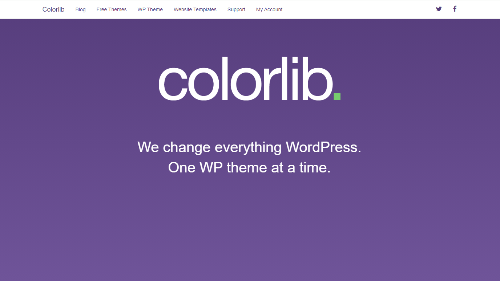
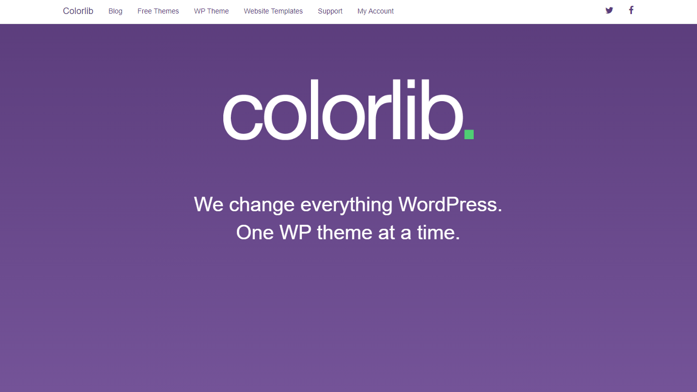
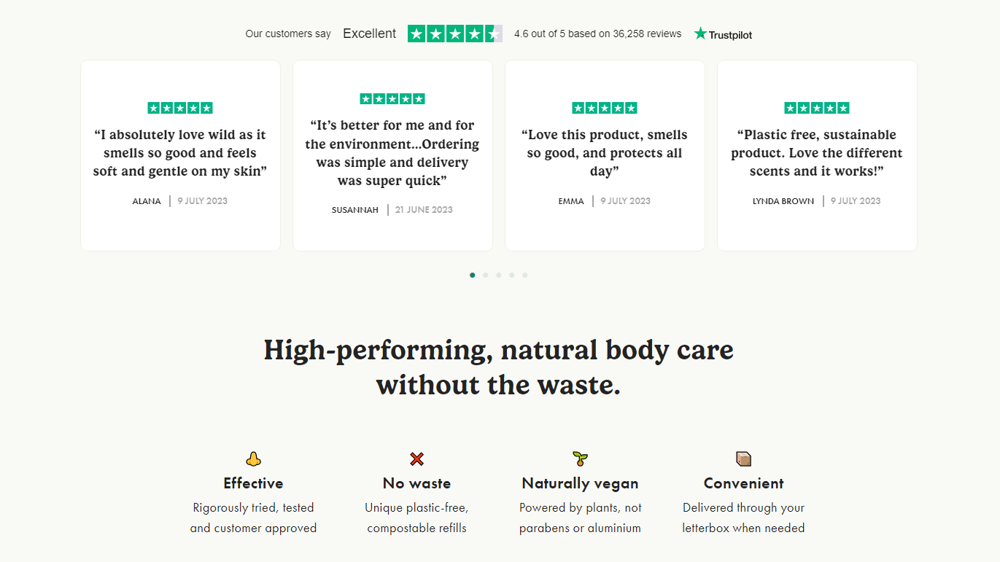
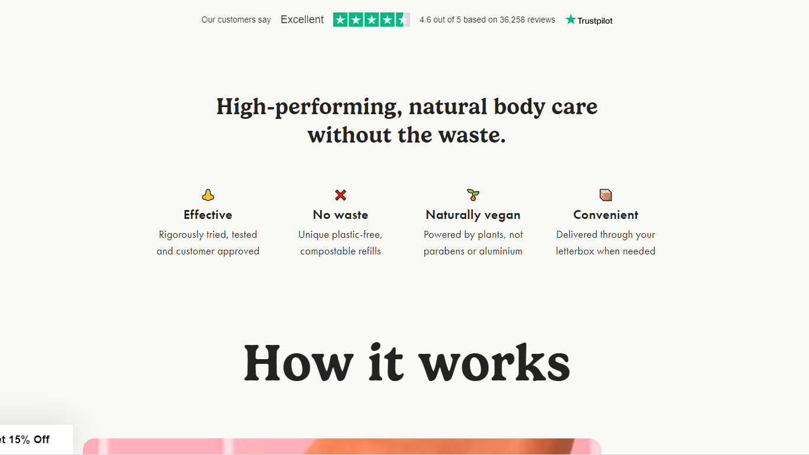

## Key differences between Bootstrap5 and raw HTML/CSS

Bootstrap5 and CSS are both languages used to style web pages developed with HTML. On the surface level, CSS is native to HTML and may be used without loading additional files unlike Bootstrap. However, their differences run much deeper than this simple feature of how they load. These key differences become apparent in their abstraction level, responsiveness, browser compatibility, and customization.

### Abstraction level

Bootstrap provides predesigned components such as navigation bars, buttons, forms, cards, modals, and more. These components come with predefined styles and behaviors, allowing developers to quickly build consistent and responsive user interfaces. On the other hand, CSS requires developers to define the styles for each element manually. While it offers more flexibility and control over the design, it also requires more time and effort to create and maintain stylesheets from scratch.

### Responsiveness

Bootstrap 5 is designed with mobile-first responsiveness in mind. Its grid system and components are built to adapt to different screen sizes and devices, ensuring a consistent user experience across desktops, tablets, and smartphones. While CSS can also be used to create responsive designs, developers need to write media queries and adjust stylesheets manually to achieve responsiveness.

### Browser compatability

Bootstrap 5 aims to provide consistent behavior and appearance across different web browsers and devices. It handles cross-browser compatibility and vendor-prefixing internally, reducing the need for developers to write browser-specific CSS. CSS requires developers to consider browser compatibility issues and write vendor prefixes for certain CSS properties to ensure consistent rendering across different browsers.

#### Bootstrap across Chrome and IE
There is no difference between these pages designed in Bootstrap when displayed in Chrome and IE.

##### Chrome

##### IE

#### CSS across Chrome and IE

As you can see, the product reviews display in Chrome but do not display in IE.

##### Chrome

##### IE

### Customization

Bootstrap 5 offers customization options that allow developers to modify the default styles and components according to their project requirements. They can customize the theme colors, typography, spacing, and other aspects using Sass variables or custom CSS. CSS provides complete control over the styling of web pages, allowing developers to create highly customized and unique designs. However, it requires more effort to create and maintain stylesheets, especially for large-scale projects.

## My experience

At first, Bootstrap5 seemed really daunting and cumbersome to learn-- and it still is. There are so many different classes and ways to edit the components. I was really intimidated by all of the new information that needed to be learned, and still am, but as I complete the practice WODs involving Bootstrap I am becoming more comfortable with the tools and structure. It actually makes a lot of sense and is simpler to use than CSS in the long run. As a result of this simplicity and Bootstrap’s ability to remain consistent across browsers and devices of different screen sizes, the framework is a great tool for software developers. Bootstrap is an efficient tool for one to use if they wish to save time on creating CSS style sheets and retain consistency in their product across different browsers. Overall, Bootstrap is well worth the headache needed to overcome the learning curve of using this framework. 

ChatGPT was used for researching the differences between Bootstrap and CSS.
