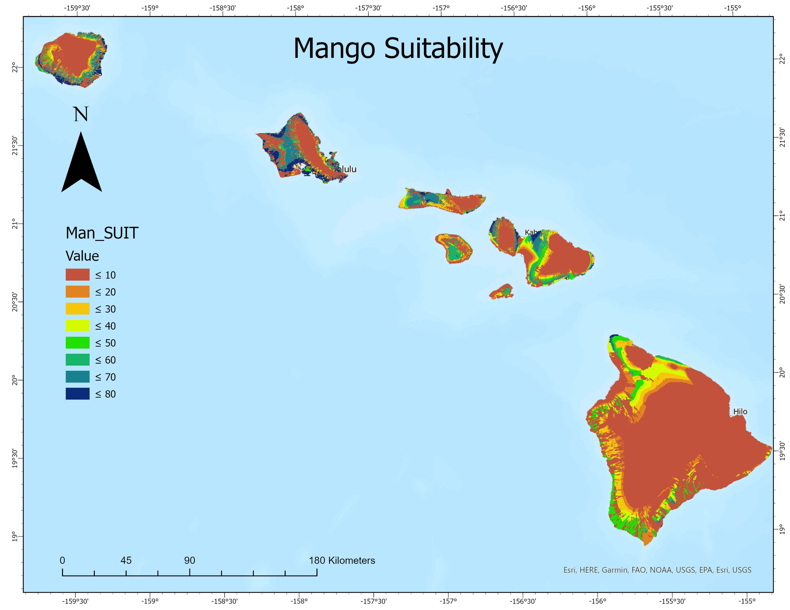
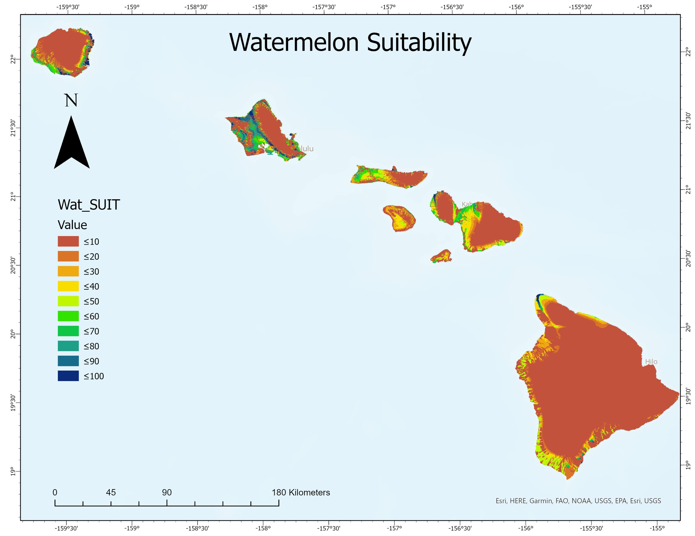
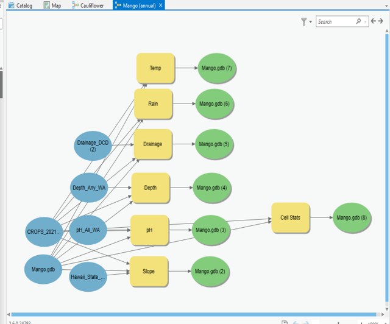

  

During my previous degree in Natural Resources and Environmental Management at UH Manoa I specialized in Geographical Information Systems (GIS). For one of my capstone projects, my class was tasked with generating a model which could predict the suitability of various different crops across the state of Hawaii. We accomplished this by combining a litany data of open source imagery and datasets which described soil composition, temperature, rainfall and topography. This data was then compared with potential crop growing conditions which had previously been researched by various entities at the College of Tropical Agriculture and Human Resources at UH Manoa. To run the models, a software called ArcGIS Pro was used to compare environmental conditions over the entire Hawaiian landscape with ideal growing characteristics of various different kinds of crops. 
 

  

For this project, the entire class learned how to build the entire model so that we could become familiar with the whole process, but we were individually tasked with running the model for particular crops. I generated the models for mango and watermelon.

  

From this project, I learned a lot about data acquisition, management, and the workflow required to manipulate various kinds of large datasets in order to produce maps in ArcGIS Pro.
