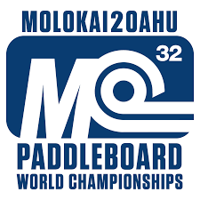
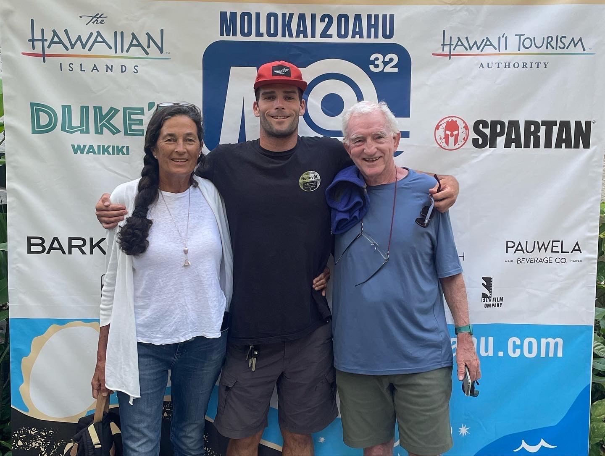

  

The Molokai to Oahu Paddleboard World Championships is an annual event which takes place between the islands of Molokai and Oahu. The race allows participants to compete in various disciplines on different types of watercraft like prone paddleboards, Stand Up paddle boards, and hydrofoils. The event takes place in a body of water called the Kaiwi Channel, also known as the “channel of bones” for its violently rough waters, and is the premier course for just about every type of self propelled watercraft in the world. This course lends itself to a form of ocean recreation called “downwinding” which can be performed on several different kinds of watercraft. Due to the consistent trade winds we experience in Hawaii that prevails from the north-east, wind swells sometimes greater than 10 feet in height are generated. This combination of wind and swell allows participants to ride the energy downwind as they cross the Kaiwi Channel.
 

  

I participated in this event for the first time in 2023 on my hydrofoil. A hydrofoil, typically constructed out of carbon fiber, acts like an airplane wing under the water and provides lift to the rider through some kind of board. I trained rigorously for this race and got myself into the best shape of my life because I wanted to be able to compete with some of the best watermen in the world. This training involved 5 land training days a week working on endurance and interval training as well as practicing my skills downwind hydrofoiling whenever it was windy. As a result of this training, I made the podium in all of the smaller preliminary races leading up to the Molokai to Oahu and felt confident I would be able to do well at the world championship race. Come race day, we were gifted with favorable conditions and I executed my race plan as well as I could have which netted me a result of 5th place overall. 

  

Overall, I am very happy with this result as it was my first year competing in this event and I had to learn a lot of lessons through the process. First, I set a goal for myself and had to follow a strict training regimen which would prepare me to complete the physically demanding race. Then, after all of the preparation, I had to figure out how to get all of my equipment and necessities to a remote part of Molokai where there are very limited resources and amenities. Finally, stressed and anxious on race day, I was able to communicate effectively with my escort boat who was providing me with navigation, focus on the task at hand, keep my composure and give it my all. As a result of this process, I learned a lot about goal setting, self motivation, logistical planning, teamwork, and grit. 
