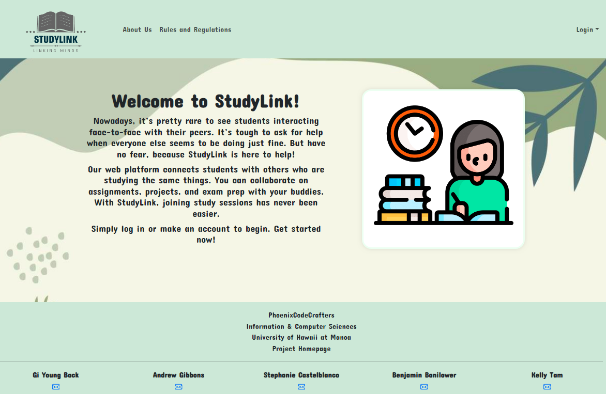
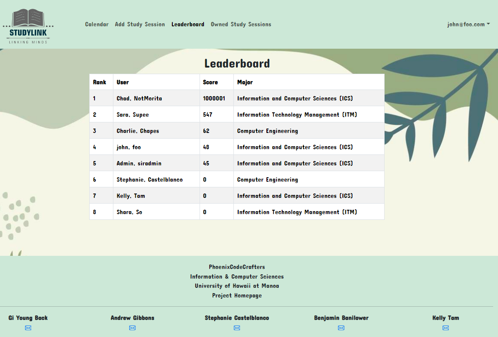

<div class="text-center p-4">
  
</div>

  For the final project in ICS 314: Intro to Software Engineering, my team developed a web application called StudyLink using the Meteor with React framework. StudyLink enables students to create and advertise study sessions which for classes they need help in or want to give help for. Upon registering an account, students may view study sessions scheduled by other students which they might like to attend. If there are no sessions on their desired topic or the timing does not work out for them, they may also create their own study session. When registering for or creating a study session, the student has the option to select "Grasshopper" or "Sensei". Grasshoppers are students which are currently taking a course and need help with the material. Senseis are students which have already taken the course and are willing to provide help to the Grasshoppers. The primary goal of the website is to match Senseis up with Grasshoppers so that collaborative learning may happen in an efficient way. All of the study sessions are run out ofthe ICS Space on the 3rd floor of POST as this website was primarily developed for ICS majors. However, it could easily be adapted and expanded to accompany all majors at UH. 

This is what the page looks like where students can view and register for study sessions:
<div class="text-center p-4">
  
</div>

  In order to incentivise the participation of Grasshoppers and Senseis, a points system was devised which grants students points when they attend a session. Three points are awarded to Senseis and two points are awarded to Grasshoppers. Points are accumilated over a semester and a leaderboard is used to show users who has the most points. If this website became available for public use, prizes would be awarded at the end of the semester to the students who use the service the most.

  I spearheaded the implementation of the leaderboard and scoring system for this class. Here is a snipped of code which sorted the list of people in decending order according to the number of points they have associated with their profile:

```js
<tbody>
  {profiles
    .slice() // Create a shallow copy of the array to avoid mutating the original array
    .sort((a, b) => b.score - a.score) // Sort the array based on the score property
    .map((score, index) => (
      <PersonItem key={`${score._id}_${index}`} profile={score} rank={index + 1} />
    ))}
</tbody>
```
The resulting leaderboard can be seen below:
<div class="text-center p-4">
  
</div>

You can learn more at the [UH Micromouse News Announcement](https://manoa.hawaii.edu/news/article.php?aId=2857).
