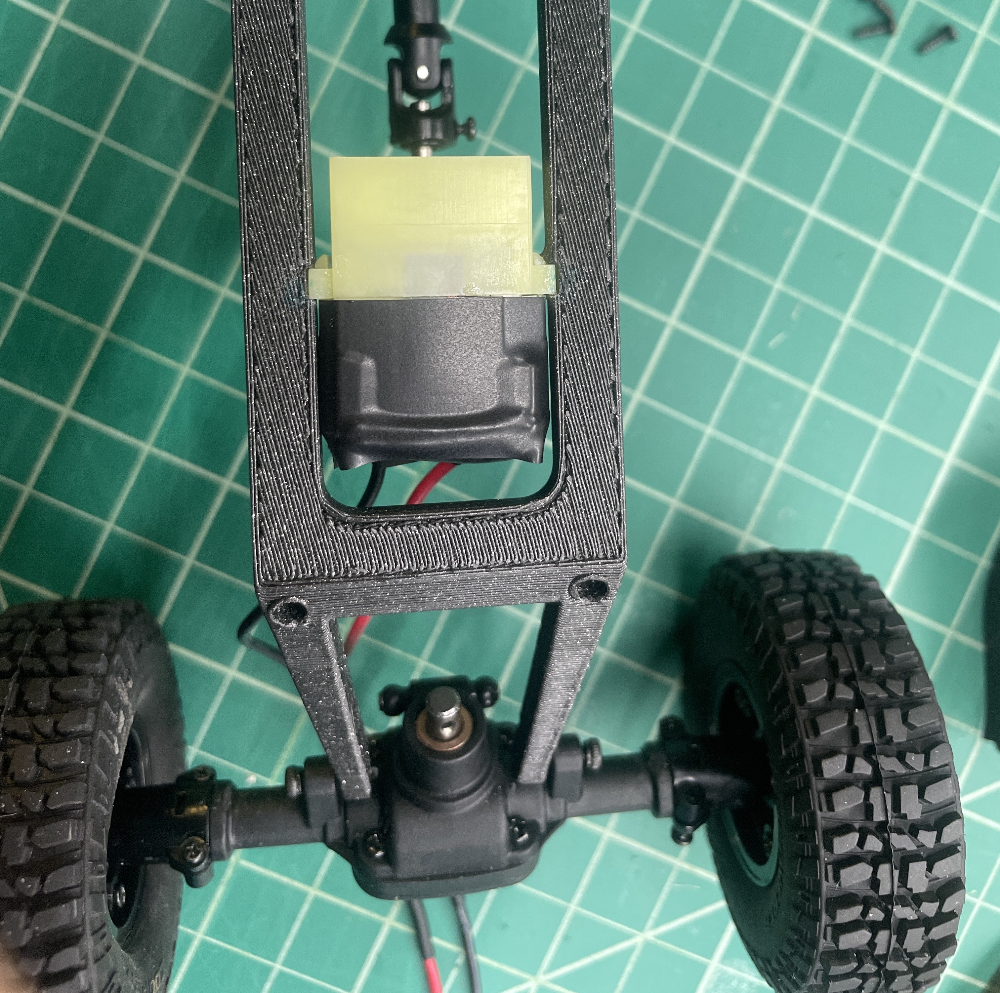

In my introduction to engineering design class, ME 213, my group was tasked with creating a flying car. As it was an introductory course, we were not expected to create all of the subsystems from scratch. Instead, all we had to do was get a drone and an RC car and figure out how to mount them to each other. Turns out this was easier said than done. After some trial and error, we discovered that the drone we bought would not be able to lift the RC car we had purchased along with the mounting assembly we designed. As a result, we had to undergo massive weight loss measures for the RC car and ended up designing a completely new chassis to attach the car components. 

 

  

I served as one of the system integrators in the project. This involved helping to design the 3D printed chassis in a software called Onshape, fit the car parts, and successfully attach it to the drone.

  

Overall, this project taught my group a lot about a common engineering experience: no matter how easy it seems, there will always be unexpected problems that need to be solved. As a result, we had to learn to trust each other as a team and problem solve. These are skills that will be able to continually build on throughout our careers and life. 
